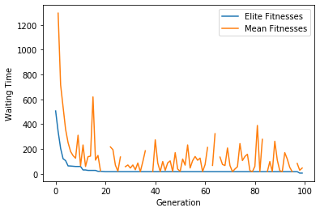
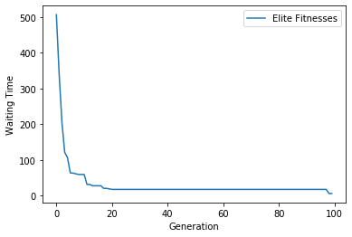

#  Traffic Signal Optimization using Genetic Algorithm

##  Overview

This project focuses on optimizing traffic signal timings at road intersections using a **Genetic Algorithm (GA)**. The goal is to reduce vehicle waiting time, minimize congestion, and improve overall traffic flow efficiency.

Traditional traffic signals operate on fixed timers, which are not suitable for dynamic traffic conditions. This project applies evolutionary optimization techniques to find the best signal timing configuration based on real-time or simulated traffic data.

---

##  Objectives

* Minimize average vehicle waiting time
* Reduce traffic congestion at intersections
* Improve traffic flow efficiency
* Compare optimized signals with fixed-time signals

---

##  Methodology

### Genetic Algorithm Steps:

1. **Initialization**
   Generate an initial population of random traffic signal timings.

2. **Fitness Function**
   Evaluate each solution based on:

   * Average waiting time
   * Queue length
   * Throughput

3. **Selection**
   Select the best-performing solutions.

4. **Crossover**
   Combine two solutions to create better offspring.

5. **Mutation**
   Introduce small random changes to maintain diversity.

6. **Iteration**
   Repeat the process until optimal or near-optimal signal timings are found.

---

##  Tech Stack

* **Python**
* **SUMO (Simulation of Urban Mobility)**
* NumPy
* Matplotlib

---

##  Simulation Setup

* Traffic intersection modeled using SUMO
* Vehicles generated with varying densities
* Signal timings controlled via GA
* Performance measured over multiple iterations

---
# Waiting time minimization in road traffic using Genetic algorithms

This project demonstrates a usage of a basic genetic algorithm to minimize the waiting time in a 4 way junction with traffic lights. I got the SUMO config files from this [repository](https://github.com/MarkJanith/Traffic-Light-Optimization).

 - Python is used with the TraCI library to communicate with SUMO simulator. 
 - Genetic Algorithm is implemented using only the numpy library. 
 - Waiting time as the fitness function

## Results




## References:
 - [Traffic-Light-Optimization](https://github.com/MarkJanith/Traffic-Light-Optimization)
 - [SUMO Tutorials](https://sumo.dlr.de/docs/Tutorials.html)

---
##  Results

* Significant reduction in average waiting time
* Improved traffic flow compared to fixed-timer signals
* Adaptive behavior based on traffic density

---

##  How to Run

### 1. Install Dependencies

```bash
pip install numpy matplotlib
```

### 2. Install SUMO

Download and install SUMO from:
https://www.eclipse.org/sumo/

Set environment variable:

```bash
export SUMO_HOME=/path/to/sumo
```

### 3. Run the Simulation

```bash
python main.py
```

---

##  Project Structure

```
├── main.py               # Main execution file
├── ga_optimizer.py      # Genetic Algorithm logic
├── simulation/          # SUMO config files
├── utils.py             # Helper functions
├── results/             # Output graphs and data
```

---

##  Future Improvements

* Integration with real-time traffic data
* Multi-intersection optimization
* Hybrid approach (GA + Machine Learning)
* Emergency vehicle priority system

---

##  Contributions

Contributions are welcome! Feel free to fork the repo and submit pull requests.

---

##  License

This project is for educational purposes.

---

##  Author

Pruthvi Raj Kaavali


---
